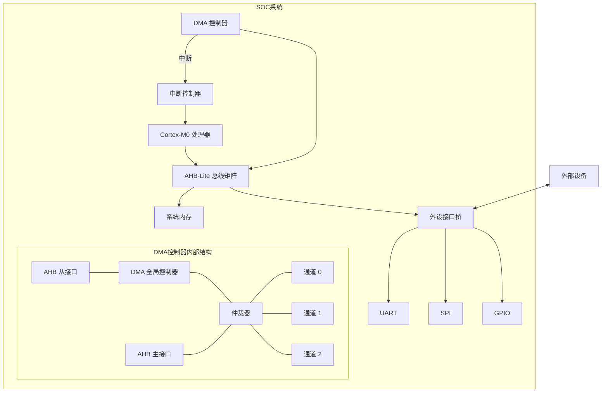
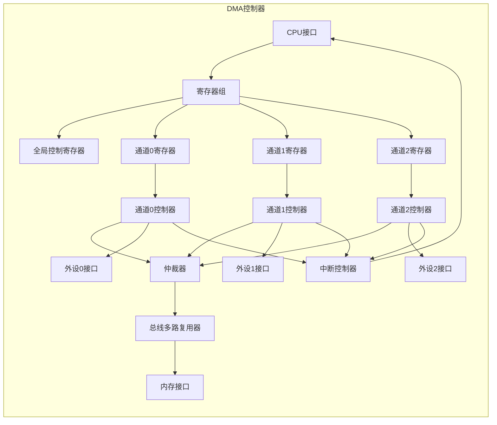
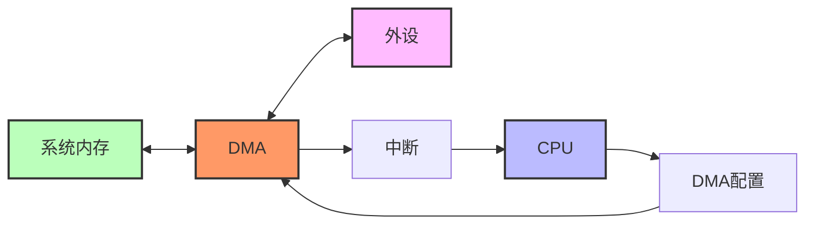
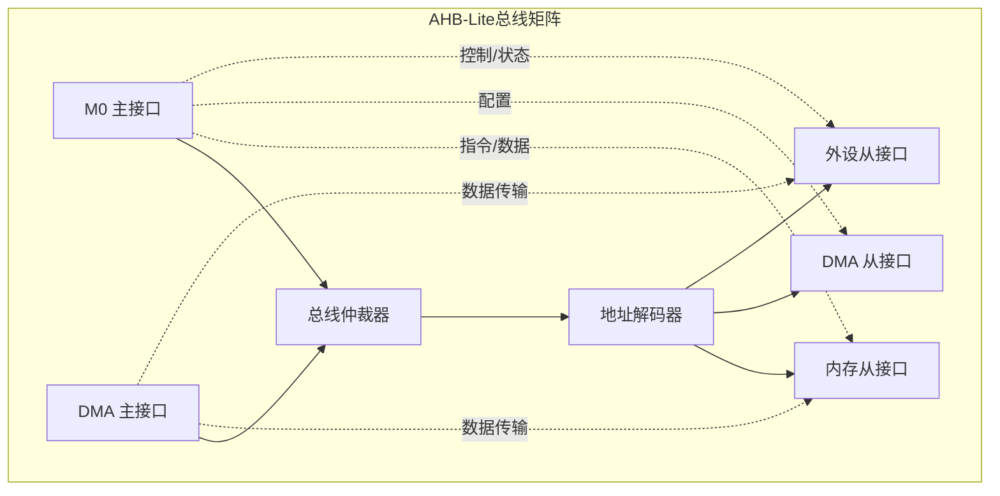
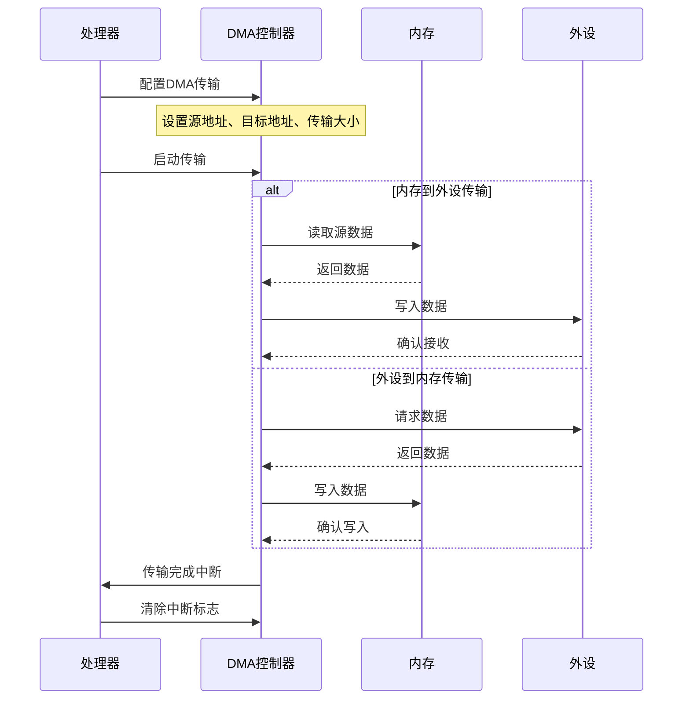

# DMA SoC 系统结构图

## 整体系统架构

```mermaid
graph TB
    subgraph "SOC系统"
        M0[Cortex-M0 处理器] --> AHB[AHB-Lite 总线矩阵]
        DMA[DMA 控制器] --> AHB
        AHB --> MEM[系统内存]
        AHB --> PERIPH[外设接口桥]
        
        subgraph "DMA控制器内部结构"
            DMA_CTRL[DMA 全局控制器] --- DMA_ARB[仲裁器]
            DMA_ARB --- CH0[通道 0]
            DMA_ARB --- CH1[通道 1]
            DMA_ARB --- CH2[通道 2]
            DMA_AHBS[AHB 从接口] --- DMA_CTRL
            DMA_AHMM[AHB 主接口] --- DMA_ARB
        end
        
        PERIPH --> UART[UART]
        PERIPH --> SPI[SPI]
        PERIPH --> GPIO[GPIO]
        
        INTR[中断控制器] --> M0
        DMA ---> |中断| INTR
    end

    EXTERNAL[外部设备] <--> PERIPH
```

## DMA 控制器详细结构

```mermaid
graph LR
    subgraph "DMA控制器"
        direction TB
        
        CPU_IF[CPU接口] --> REG[寄存器组]
        REG --> GLOBAL[全局控制寄存器]
        REG --> CH0_REG[通道0寄存器]
        REG --> CH1_REG[通道1寄存器]
        REG --> CH2_REG[通道2寄存器]
        
        ARB[仲裁器] --> BUS_MUX[总线多路复用器]
        
        CH0_CTRL[通道0控制器] --> ARB
        CH1_CTRL[通道1控制器] --> ARB
        CH2_CTRL[通道2控制器] --> ARB
        
        CH0_REG --> CH0_CTRL
        CH1_REG --> CH1_CTRL
        CH2_REG --> CH2_CTRL
        
        BUS_MUX --> MEM_IF[内存接口]
        
        CH0_CTRL --> P0_IF[外设0接口]
        CH1_CTRL --> P1_IF[外设1接口]
        CH2_CTRL --> P2_IF[外设2接口]
        
        IRQ_CTRL[中断控制器] --> CPU_IF
        CH0_CTRL --> IRQ_CTRL
        CH1_CTRL --> IRQ_CTRL
        CH2_CTRL --> IRQ_CTRL
    end
```

## 数据流图

```mermaid
flowchart LR
    MEM[系统内存] <--> DMA
    DMA <--> PERI[外设]
    CPU --> DMA_CONFIG[DMA配置]
    DMA_CONFIG --> DMA
    DMA --> INT[中断]
    INT --> CPU
    
    style DMA fill:#f96,stroke:#333,stroke-width:2px
    style CPU fill:#bbf,stroke:#333,stroke-width:2px
    style MEM fill:#bfb,stroke:#333,stroke-width:2px
    style PERI fill:#fbf,stroke:#333,stroke-width:2px
```

## AHB-Lite 总线结构

```mermaid
graph TB
    subgraph "AHB-Lite总线矩阵"
        direction LR
        M0[M0 主接口] --> ARBITER[总线仲裁器]
        DMA_M[DMA 主接口] --> ARBITER
        
        ARBITER --> DECODER[地址解码器]
        
        DECODER --> MEM_S[内存从接口]
        DECODER --> DMA_S[DMA 从接口]
        DECODER --> PERI_S[外设从接口]
    end
    
    M0 -.-> |指令/数据| MEM_S
    M0 -.-> |配置| DMA_S
    M0 -.-> |控制/状态| PERI_S
    
    DMA_M -.-> |数据传输| MEM_S
    DMA_M -.-> |数据传输| PERI_S
```

## 信号交互图

```mermaid
sequenceDiagram
    participant CPU as 处理器
    participant DMA as DMA控制器
    participant Mem as 内存
    participant Periph as 外设
    
    CPU->>DMA: 配置DMA传输
    Note over DMA: 设置源地址、目标地址、传输大小
    CPU->>DMA: 启动传输
    
    alt 内存到外设传输
        DMA->>Mem: 读取源数据
        Mem-->>DMA: 返回数据
        DMA->>Periph: 写入数据
        Periph-->>DMA: 确认接收
    else 外设到内存传输
        DMA->>Periph: 请求数据
        Periph-->>DMA: 返回数据
        DMA->>Mem: 写入数据
        Mem-->>DMA: 确认写入
    end
    
    DMA->>CPU: 传输完成中断
    CPU->>DMA: 清除中断标志
```
